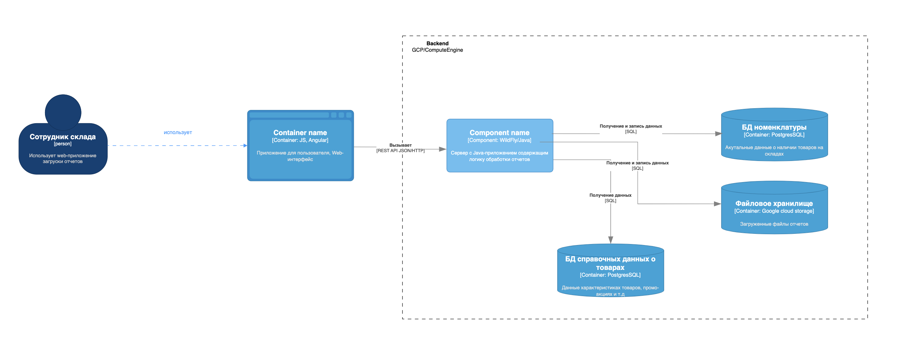

* Контекст
- *компания*
    - развивающаяся компания
- *клиент*
    - малому и среднему бизнесу
- *продукт*
    - API для 
        - интеграции со складскими системами 
        - и управления товарными остатками.

** Проблемы
*** Проблема масштабируемости
- Узел
    - Технологическая база 
- Проблема
    - не готова полностью к обработке больших объёмов данных
- Ситуация 
    - пиковых периодов поставок 
    - и строительного сезона.
- Узкие места
    - кол-во операций
        - движением товарных остатков, 
        - оформлением заявок на поставку 
            - внутренней логистикой между складами
- Механизм
    - обрабатывать каждую запись отдельно немедленно, обновление бд построчно
    - отчетность формируется в реальном времени, хотя можно было и ночью
- Последствия
    - падает операционная эффективность
        - отчёты по остаткам «висят»,
        - обновления позиций 
            - происходят с большой задержкой 
            - либо вовсе не применяются.
        - Замедляется работа ERP-интерфейса при 
            - формировании складских заданий 
            - и приёме материалов.
- Ущерб
    - приводят к просрочкам поставок и неэффективной логистике. 
    - На уровне клиентов возникают цепные задержки в строительных процессах, 
        - что провоцирует финансовые и репутационные риски.

**** Нагрузка
- в пике
    - на систему обновления остатков
        - 400 000 строк в сутки, поступающих с региональных складов в виде файлов. 
- Нагрузка в пиковые дни (например, при передаче стройматериалов на крупные объекты)
    - возрастает в 2–3 раза.
При низкой нагрузке, когда операций по складам меньше, система работает стабильно

**** Флоу
- Валидация формата и целостности поступающих данных
- Обновление позиций актуальной справочной информацией на основе 
    - обновлений на складах, 
    - изменений 
    - промоакций 
    - и так далее.
- Загрузка обновлённых данных из загруженного отчёта в результирующую таблицу.

Пояснения к схеме:
1. Пользователь на основе Excel-шаблона формирует отчёт по остаткам и сохраняет его как CSV-файл. 
    1. Поэтому первичная валидация формата данных происходит на уровне Excel-шаблона.
1. Пользователь запускает загрузку полученного CSV-файла через интерфейс ERP:
    1. Файл проходит дополнительную валидацию на уровне Java-приложения.
    1. В случае ошибки пользователь получает ответ в браузере: «Ошибка формата загружаемых данных».
    1 Файл сохраняется в хранилище в GCS.
    1. Запускается процесс
        1. обработки файла, 
        1. обновление значениями из БД справочных данных 
        1. и сохранения данных в БД номенклатуры.
    1. Если операция обработки завершается успешно, то пользователь получает уведомление об этом.
1. Пользователь дожидается успешного завершения загрузки.
    1. При ошибке в формате данных пользователь вносит необходимые исправления в отчёт и повторяет загрузку.

*** Проблема наблюдаемости
- Узел
    - IT-инфраструктуре
- Проблема
    - отсутствуют средства мониторинга системы
    - В случае ошибок трудно отследить причину её возникновения и свести имеющиеся логи и метрики в одну картину.
- Узкие места
    - Есть только 
        - логи в файл 
        - и стандартный мониторинг ресурсов VM и WildFly.
- Механизм
    - отчетность формируется в реальном времени

*** Исходный ландшафт
- IT-инфраструктура
    - расположена в облаке - Google Cloude Platform
        - монолит + БД
            - складские остатки товаров и перемешения товаров
                - формирует об этом отчеты
                - предоставляет пользовательский интерфейс
                    - сотрудник склада загружает отчёт об 
                        - остатках 
                        - и перемещениях в конце рабочей смены.
        - сервис учета хранения и логистических операций
            - формирует отчёты о движении товаров и выгружает их в CSV по факту перемещения товаров.
        - фронтенд приложение
            - отображение 
                - текущих остатков товаров, 
                - истории перемещений 
                - и аналитики.

    - хостинг файлов с отчетами - в облаке - Google Cloud Storage

*** Тенденции
- Ближайшее будущее
    - значительный рост
        - числа пользователей
        - заявок на хранение
        - объемов данных по движениям

    - TradeWare сбирается расширить
        - номенклатуру товаров 
        - и интеграцию с другими источниками данных, что потребует гибких способов проектирования пайплайна данных и retry-механизмы в них. 

- Промежуточное состояние (2 мес)
    - сформирован план, как решить уже имеющиеся проблемы с производительностью системы,
    - подготовить её к росту объёма обрабатываемых данных.

**** Запросы бизнеса
- Обеспечение надёжной работы под возрастающей нагрузкой.
    - Предполагаемая нагрузка в пиковые часы — 100–150 параллельных загрузок. 
    - Возможность гибко масштабироваться под нагрузкой.
- Соблюдение требований к производительности:
    - среднее время обработки отчёта на 2 000 строк составляет до 30 секунд.
- Внедрение системы централизованного сбора логов и метрик.
- Формирование решения для дальнейшей миграции в МСА. 
    - Оно должно позволить
        - постепенно вынести функционал из монолита в развёрнутые рядом сервисы, 
        - интегрироваться с Java-экосистемой 
        - и внедрять инструменты логирования и мониторинга, 
            - которые будут удобно сочетаться с микросервисной архитектурой.
